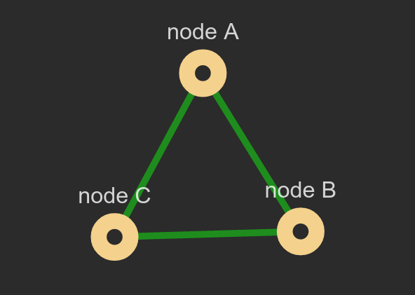

What is NetJSON?
================

.. contents:: **Table of Contents**:
    :backlinks: none
    :depth: 3

NetJSON is a data interchange format based on JavaScript Object Notation
(JSON) designed to describe the basic building blocks of layer2 and layer3
networks.

It defines several types of JSON objects and the manner in which they are
combined to represent a network:

- network configuration of devices
- monitoring data
- routing information
- network topology

NetJSON aims to create an ecosystem of interoperable software that will
enable developers to write network-centric applications faster and better.
You can find out more about the motivations and goals of NetJSON in
:doc:`"Why NetJSON?"<why>`.

Specification
-------------

We are putting effort into writing a readable and easy to understand
`specification <https://netjson.org/rfc.html>`_, which is the official
document explaining NetJSON.

If you want to get a quick overview of what NetJSON can offer read on, but
refer to the `NetJSON Draft Specification <https://netjson.org/rfc.html>`_
for more detailed information.

DeviceConfiguration
-------------------

The ``DeviceConfiguration`` object aims to describe the network
configuration of a device like a router, a wireless point to point device,
a server, a raspberry pi or whatever is able to send packets through a
computer network.

A simplified DeviceConfiguration example
~~~~~~~~~~~~~~~~~~~~~~~~~~~~~~~~~~~~~~~~

.. code-block:: javascript

    {
        "type": "DeviceConfiguration",
        "general": {
            "hostname": "RouterA"
        },
        "interfaces": [
            {
                "name": "lo0",
                "type": "ethernet",
                "addresses": [
                    {
                        "address": "127.0.0.1",
                        "mask": 8,
                        "proto": "static",
                        "family": "ipv4"
                    }
                ]
            },
            {
                "name": "eth0",
                "type": "ethernet",
                "addresses": [
                    {
                        "address": "192.168.1.1",
                        "mask": 24,
                        "proto": "static",
                        "family": "ipv4"
                    }
                ]
            }
        ]
    }

The previous example describes a device named ``RouterA`` which has two
interfaces: the typical loopback interface and an ethernet interface named
``eth0`` which has a statically assigned ip address ``192.168.1.1`` and a
network mask of ``24`` bits (CIDR notation).

DeviceConfiguration specification
~~~~~~~~~~~~~~~~~~~~~~~~~~~~~~~~~

For a full specification, please refer to the `relevant DeviceConfiguration
section in the NetJSON Specification
<https://netjson.org/rfc.html#rfc.section.5>`_.

DeviceMonitoring
----------------

The ``DeviceMonitoring`` object aims to describe the status of a network
device, like its uptime, its rx/tx packet count, cpu usage and any other
bit of information that is useful for network monitoring purposes.

A simplified DeviceMonitoring example
~~~~~~~~~~~~~~~~~~~~~~~~~~~~~~~~~~~~~

.. code-block:: javascript

    {
        "type": "DeviceMonitoring",
        "general": {
            "hostname": "RouterA",
            "uptime": 3501937
        },
        "interfaces": [
            {
                "name": "lo0",
                "uptime": 1404305354,
                "statistics": {
                   "collisions": 0,
                   "rx_frame_errors": 0,
                   "tx_compressed": 0,
                   "multicast": 0,
                   "rx_length_errors": 0,
                   "tx_dropped": 0,
                   "rx_bytes": 9287737,
                   "rx_missed_errors": 0,
                   "tx_errors": 0,
                   "rx_compressed": 0,
                   "rx_over_errors": 0,
                   "tx_fifo_errors": 0,
                   "rx_crc_errors": 0,
                   "rx_packets": 57624,
                   "tx_heartbeat_errors": 0,
                   "rx_dropped": 0,
                   "tx_aborted_errors": 0,
                   "tx_packets": 57624,
                   "rx_errors": 0,
                   "tx_bytes": 9287737,
                   "tx_window_errors": 0,
                   "rx_fifo_errors": 0,
                   "tx_carrier_errors": 0
                }
            },
            {
                "name": "eth0",
                "uptime": 1294305354,
                "statistics": {
                    "collisions": 0,
                    "rx_frame_errors": 0,
                    "tx_compressed": 0,
                    "multicast": 0,
                    "rx_length_errors": 0,
                    "tx_dropped": 0,
                    "rx_bytes": 3542783708,
                    "rx_missed_errors": 0,
                    "tx_errors": 0,
                    "rx_compressed": 0,
                    "rx_over_errors": 0,
                    "tx_fifo_errors": 0,
                    "rx_crc_errors": 0,
                    "rx_packets": 35118502,
                    "tx_heartbeat_errors": 0,
                    "rx_dropped": 14,
                    "tx_aborted_errors": 0,
                    "tx_packets": 11761973,
                    "rx_errors": 0,
                    "tx_bytes": 2952333765,
                    "tx_window_errors": 0,
                    "rx_fifo_errors": 0,
                    "tx_carrier_errors": 0
                }
            }
        ]
    }

This example refers to the same router shown in the `DeviceConfiguration
example <#a-simplified-deviceconfiguration-example>`_ shown earlier, but
this time the JSON object contains basic network traffic statistics of the
interfcaes of ``RouterA``: ``lo0`` and ``eth0``.

DeviceMonitoring specification
~~~~~~~~~~~~~~~~~~~~~~~~~~~~~~

For a full specification, please refer to the `relevant DeviceMonitoring
section in the NetJSON Specification
<https://netjson.org/rfc.html#rfc.section.6>`_.

NetworkRoutes
-------------

The ``NetworkRoutes`` object aims to describe a list of routes that are
installed in a routing table.

``NetworkRoutes`` allows to represent either dynamic or statifc routes.

A simplified NetworkRoutes example
~~~~~~~~~~~~~~~~~~~~~~~~~~~~~~~~~~

.. code-block:: javascript

    {
        "type": "NetworkRoutes",
        "protocol": "olsrv2",
        "version": "0.8.2",
        "revision": "v0.8.2-6-ge2e3acc",
        "metric": "ff_dat_metric",
        "router_id": "192.168.0.101",
        "routes": [
            {
                "destination": "192.168.0.102",
                "next": "169.254.1.102",
                "cost": 4292352,
                "device": "eth1"
            }
        ]
    }

This example shows a list of routes installed in a router. The network in
this example is very small because the routing table contains only one
route. In this example the routes are managed by the `olsrd2 routing deamon
<http://www.olsr.org/mediawiki/index.php/OLSR.org_Network_Framework>`_.

NetworkRoutes specification
~~~~~~~~~~~~~~~~~~~~~~~~~~~

For a full specification, please refer to the `relevant NetworkRoutes
section in the NetJSON Specification
<https://netjson.org/rfc.html#rfc.section.3>`_.

NetworkGraph
------------

The ``NetworkGraph`` object aims to describe the topology of a network and
it's comprised of a list of nodes and a list of links between nodes.

It's main goal is to allow to visualize and monitor links between nodes in
a network (eg: understanding when a link fails), but implementations for
distance vector routing protocols are allowed to return a partial view of
the network which can be used by a collector to build the full graph.

A simplified NetworkGraph example
~~~~~~~~~~~~~~~~~~~~~~~~~~~~~~~~~

.. code-block:: javascript

    {
        "type": "NetworkGraph",
        "protocol": "olsr",
        "version": "0.6.6",
        "revision": "5031a799fcbe17f61d57e387bc3806de",
        "metric": "etx",
        "router_id": "172.16.40.24",
        "label": "Test Network",
        "nodes": [
            {
                "id": "172.16.40.24",
                "label": "node A",
                "properties": {
                    "hostname": "node1.my.net"
                }
            },
            {
                "id": "172.16.40.60",
                "label": "node B",
                "properties": {
                    "hostname": "node2.my.net"
                }
            },
            {
                "id": "172.16.41.1",
                "label": "node C",
                "properties": {
                    "hostname": "node3.my.net"
                }
            }
        ],
        "links": [
            {
                "source": "172.16.40.24",
                "target": "172.16.40.60",
                "cost": 1.000
            },
            {
                "source": "172.16.40.24",
                "target": "172.16.41.1",
                "cost": 1.000
            },
            {
                "source": "172.16.40.60",
                "target": "172.16.41.1",
                "cost": 1.000
            }
        ]
    }

This example shows a small `mesh network
<https://openwisp.io/docs/dev/tutorials/mesh.html>`_ of 3 nodes which are
connected in full mesh.

When processed with one of the existing implementations
(`openwisp-network-topology
<https://openwisp.io/docs/dev/network-topology/>`_), the previous
``NetworkGraph`` object results in the following image:

NetworkGraph specification
~~~~~~~~~~~~~~~~~~~~~~~~~~

For a full specification, please refer to the `relevant NetworkGraph
section in the NetJSON Specification
<https://netjson.org/rfc.html#rfc.section.4>`_.

NetworkCollection
-----------------

The ``NetworkCollection`` object is a wrapper that can be used to list
several NetJSON objects in a single JSON object.

A simplified NetworkCollection example
~~~~~~~~~~~~~~~~~~~~~~~~~~~~~~~~~~~~~~

.. code-block:: javascript

    {
        "type": "NetworkCollection",
        "collection": [
            {
                "type": "DeviceConfiguration",
                "general": {
                    "hostname": "RouterA"
                },
                "interfaces": [
                    {
                        "name": "eth0",
                        "type": "ethernet",
                        "addresses": [
                            {
                                "address": "192.168.1.1",
                                "mask": 24,
                                "proto": "static",
                                "family": "ipv4"
                            }
                        ]
                    }
                ]
            },
            {
                "type": "DeviceConfiguration",
                "general": {
                    "hostname": "RouterB"
                },
                "interfaces": [
                    {
                        "name": "eth0",
                        "type": "ethernet",
                        "addresses": [
                            {
                                "address": "192.168.1.2",
                                "mask": 24,
                                "proto": "static",
                                "family": "ipv4"
                            }
                        ]
                    }
                ]
            }
        ]
    }

In this two ``DeviceConfiguration`` objects are grouped in a single
``NetworkCollection`` object that acts as a list of configurations.

NetworkCollection specification
~~~~~~~~~~~~~~~~~~~~~~~~~~~~~~~

For a full specification, please refer to the `relevant NetworkCollection
section in the NetJSON Specification
<https://netjson.org/rfc.html#rfc.section.5>`_.
